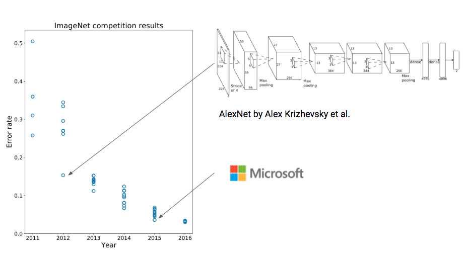

# AIsda
#### Fish recognition using AI
by Prince Javier

Let me start with a bit of history. 

Hundreds of thousands of years ago, people have already been impacting wild animals and plants. Species dying off is not a recent phenomenon. And our capacity to change landscapes and animal populations have been made so easy with technology such as fire.

  

It’s no coincidence that large animals have gone extinct the moment modern humans have intruded into their territory. Humans have been impacting the earth ever since.

Woolly mammoths have been killed off by humans just four thousands of years ago. Neither is it coincidence that giant sloths of Australia have suddenly gone extinct at the same time modern humans stepped foot on the continent. 

  
   

Today, we have advanced so much that we have started a mass extinction event akin to what happened 66 million years ago.

Our machines like fishing ships, tree cutters, and guns have made killing much more efficient. Our industries and use of fossil fuels have generated so much greenhouse gases to the point of altering the world’s climate. We have invented a material called plastic that doesn’t degrade, goes to our oceans and traps marine life.

An estimated of 200-2000 species go extinct each year.

Meanwhile, 15 billion trees are cut each year. This is equivalent to forests the area of three football fields every second.

  

Fish, are important players in ecosystems. They are food sources for many species down the food chain like birds, seagulls, polar bears, and humans. In the Philippines, more than 50% of our animal protein intake comes from fish. They also play a role in enriching coral reefs with nutrients for them to thrive. Coral reefs are important habitats for marine animals. Coral reefs in the Philippines, in particular, are the most biodiverse in the world.

However, fish populations are now declining due to overfishing and climate change. Their numbers have already halved since 1970. It is thus important that we restore and conserve fish populations. We don’t want to tip the balance of ecosystems on which we rely on.

While fish in the oceans have been declining, AI research, especially in the fields of deep learning, has been gaining traction in the past few years. 

Image recognition, in particular, has seen a leap in performance in 2012 when Alex Krizhevsky and his team unveiled a deep convolutional network called AlexNet. In 2015, Microsoft’s AI beat humans in object identification.

  

> Our question is how can we use these advancing AI technologies to help in conserving fish in the oceans?

  

There are over 30,000 fish species identified so far. Currently, auditing of fish entails divers and manually counting and identifying fish. With the sheer number of fish and large swaths of coral reefs, manual auditing is not scalable. If we can train an AI to identify and count fish from photos and videos, then we can automate and scale auditing using photos captured from underwater cameras. We can expand the scope of audit spatially and in time. This will not replace manual audits by divers but will rather augment them.

UP Marine Science Institute recently unveiled ARAICoBeH (A Rapid Assessment Instrument for Coastal Benthic Habitats) to capture images of underwater habitats. We can tap them to train an AI on their images to automate counting and identification of marine life.

